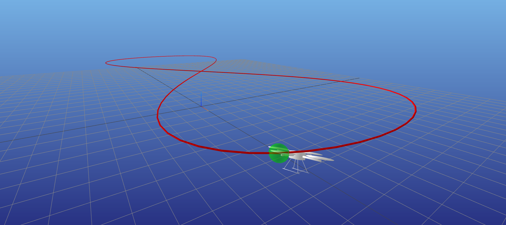
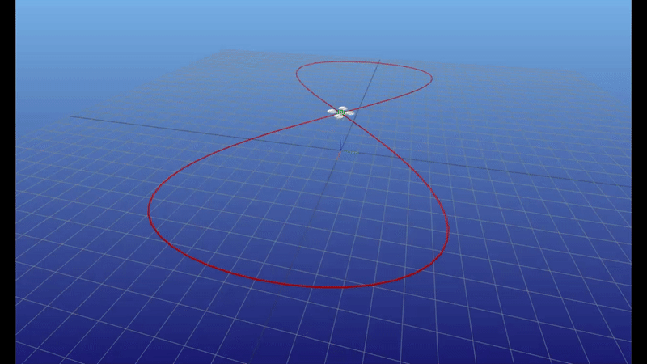

# quadrotor_mpc

Trajectory tracking with a quadrotor.

The non-linear dynamics are linearized about a linearization trajectory 
$\bar{x}, \bar{u}$ while the quadrotor aims to track a different reference trajectory 
$x_{ref}, u_{ref}$.

<p align="center" width="100%">
    
    <br>Quadrotor and reference trajectory
</p>

The MPC controller solves the following optimization problem :

$$ \begin{align*} 
\min_{x_{1:N},u_{1:N-1}} \quad & \sum_{i=1}^{N-1} \bigg[ (x_i - x_{i,ref})^TQ(x_i - x_{i,ref}) + (u_i - u_{i,ref})^TR(u_i - u_{i,ref}) \bigg] + \frac{1}{2}(x_N - x_{N,ref})^TQ_f(x_N - x_{N,ref}) \\ 
 \text{st} \quad & x_1 = x_{\text{IC}} \\ 
 & x_{k+1} = f(\bar{x}_k, \bar{u}_k) + \bigg[\frac{\partial f}{\partial x} \bigg|_{\bar{x}_k, \bar{u}_k}  \bigg](x_k - \bar{x}_k) + \bigg[\frac{\partial f}{\partial u} \bigg|_{\bar{x}_k, \bar{u}_k}  \bigg](u_k - \bar{u}_k)   \quad \text{for } i = 1,2,\ldots,N-1 \\ 
 & u_{min} \leq u_i \leq u_{max} \quad ~~~~~~~~~~~~~~~~~~~~~~~~~~~~~~~~~~~~~~~~~~~~~~~~~~~~~~~~~~~~~~~~~~~~~~~~~~~~~ \text{for } i = 1,2,\ldots,N-1\\ 
 \end{align*}$$


<p align="center" width="100%">
    
    <br>Trajectory tracking with MPC controller
</p>


Technologies
------------
The project was created with:
* Python 3.9.0
* numpy 1.24.2
* cvxpy 1.3.1
* matplotlib 3.6.2
* seaborn 0.12.2
* pandas 1.5.3
* jax 0.3.25


Installation
------------

To use this project, install it locally via:
```
git clone https://github.com/elena-ecn/quadrotor_mpc.git
```

The dependencies can be installed by running:
```
pip install -r requirements.txt
```

To execute the code, run:
```
python3 main.py
```

License
-------
The contents of this repository are covered under the [MIT License](LICENSE).